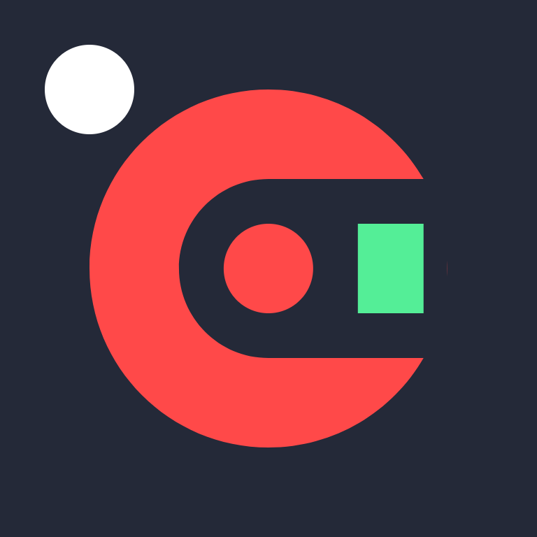
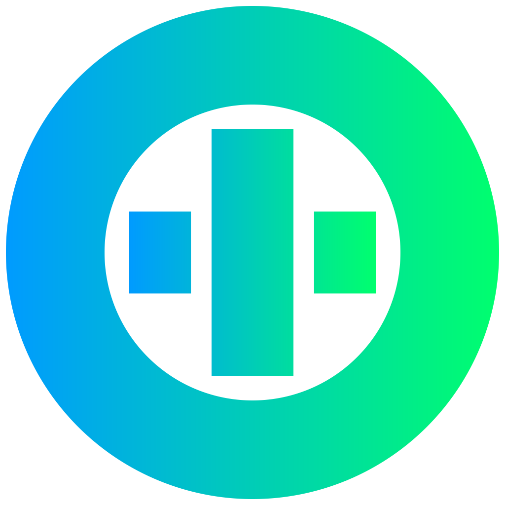

# Hi there 👋 

# 🌟 **Design & Tools**

  
  
  
  
  
  

# 🌟 **My Skills & Tools**

 |  |   |  |  | 
:---:|:---:|:---:|:---:|:---:|:---:
 | AenoScript | Pnlo | bplm | Vue | 
 |  |  |  |   | 
 |  |  |  |  | 

 

<!-- 

  

# zh_cn 

-->

